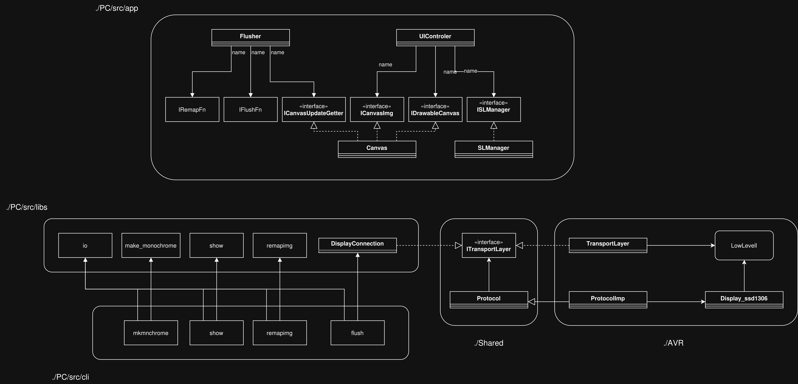
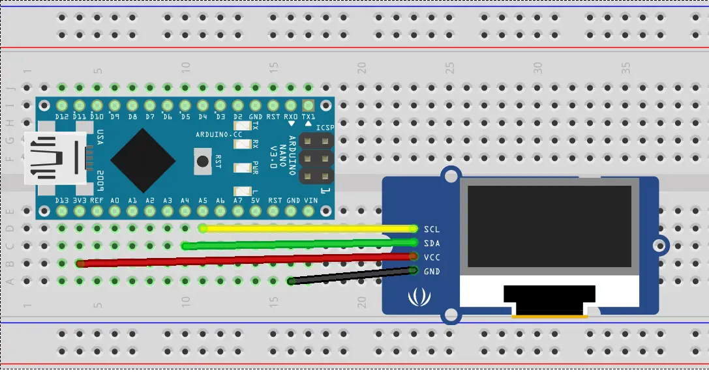

# Bare-Metal Display Controller System

A full-stack embedded graphics system built from scratch. It enables image streaming from a Linux PC to an SSD1306 OLED display via a custom UART-to-I2C bridge on an ATMega328PB microcontroller.

This project was developed to master low-level communication protocols, system architecture, and bare-metal programming without relying on heavy external abstractions (like Arduino HAL).

---

## 🏗 System Architecture

The system follows a modular design where the PC handles heavy image processing, and the MCU acts as a high-speed driver.

**Data Flow:**
`[PNG Image] -> [CLI Tools / GUI] -> (UART) -> [ATMega328PB] -> (I2C) -> [SSD1306 Display]`


*(Note: Place your system diagram here if you created one)*

---

## 🛠 PC Software (`./PC`)

The host software is built on the **Unix Philosophy**: small tools that do one thing well, connected by pipes.

### 1. Command-Line Tools ( The Pipeline )
Designed to be chained together via `stdin`/`stdout`.

| Tool | Description |
| :--- | :--- |
| **`mkmnchrom`** | **Image Processor.** Converts standard images (PNG/JPG) to raw monochrome bits (row-major, 128x64). |
| **`remapimg`** | **Memory Mapper.** Transforms row-major data into the specific page-addressing format required by the SSD1306 controller. |
| **`flush`** | **Driver.** Reads binary data and manages the Serial/UART transmission to the MCU. |
| **`show`** | **Debugger.** Renders the raw binary stream directly in the terminal using ASCII art for verification. |

## 🔌 Hardware Setup



**Usage Example:**
```bash
# Convert, remap, and send to hardware in one line:
./mkmnchrom image.png | ./remapimg | ./flush

# Preview an image in the terminal:
./mkmnchrom image.png | ./show

2. GUI Application (MyApp)

A real-time drawing dashboard built with FLTK.

    Features: Live drawing canvas, save-to-binary, real-time hardware sync.

    Tech: Uses Multithreading (std::thread, std::mutex) to separate the UI loop from the blocking UART transmission.

⚡ Firmware (./AVR)

Bare-metal firmware for the ATMega328PB.

    No Arduino HAL: Direct register manipulation for maximum understanding and efficiency.

    Communication:

        UART: Receives raw packets from PC.

        I2C: High-speed transmission to the SSD1306.

    Architecture: Implements a Finite State Machine (FSM) to parse the custom binary protocol.

    Note: The firmware is highly optimized for the ATMega328PB and requires a specific toolchain (avr-g++, avr-libc, make).


🚀 Getting Started
Prerequisites

    OS: Linux (Requires access to /dev/ttyUSB0)

    Hardware: ATMega328PB, SSD1306 OLED Display.

    Software: CMake, FLTK (libfltk1.3-dev), avr-gcc toolchain.

1. Build PC Tools
Bash

cd PC
mkdir build && cd build
cmake ..
make
# Executables will be placed in ./bin/

2. Flash Firmware
Bash

cd AVR
make flash
# Ensure your programmer is connected to /dev/ttyUSB0

💡 Key Engineering Concepts Demonstrated

    Unix Pipes: decoupling data generation from data transmission.

    Cross-Platform Architecture: Sharing C++ headers (Shared/) between x86 (PC) and AVR (MCU).

    Concurrency: Thread-safe resource sharing in the GUI application.

    Bitwise Operations: Manual pixel mapping and frame buffer manipulation


